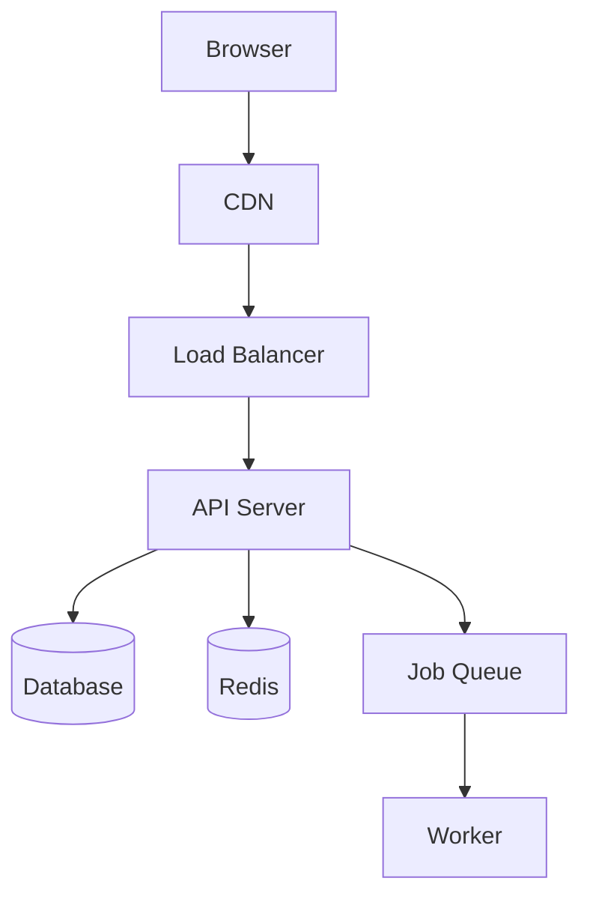
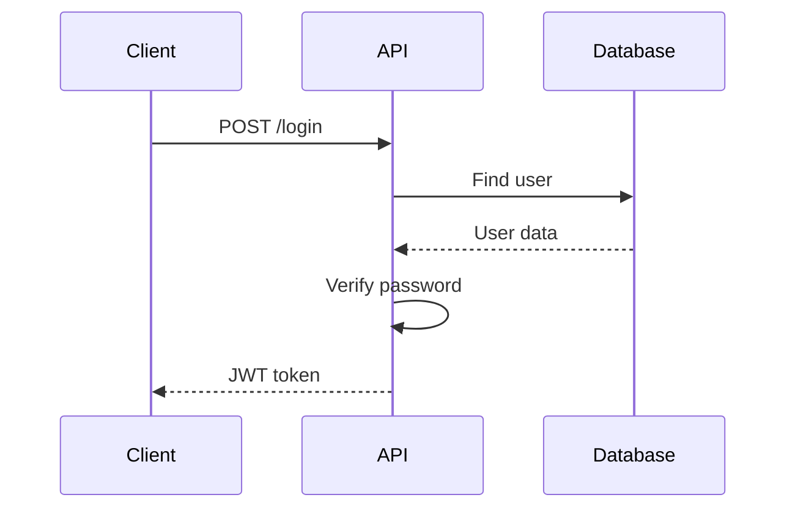
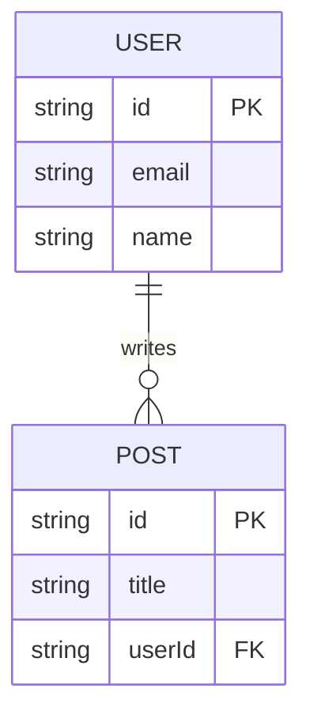

# 📖 Auto-Docs Mode

Generate documentation automatically from code.

## API Documentation

### OpenAPI/Swagger from Code

```bash
# Express with swagger-jsdoc
npm install swagger-jsdoc swagger-ui-express

# Generate spec
// turbo  
npx swagger-jsdoc -d swaggerDef.js -o swagger.json
```

### JSDoc to OpenAPI

```typescript
/**
 * @openapi
 * /api/users:
 *   get:
 *     summary: Get all users
 *     tags: [Users]
 *     responses:
 *       200:
 *         description: List of users
 *         content:
 *           application/json:
 *             schema:
 *               type: array
 *               items:
 *                 $ref: '#/components/schemas/User'
 */
app.get('/api/users', getUsers);
```

### Swagger UI Setup

```typescript
import swaggerUi from 'swagger-ui-express';
import swaggerSpec from './swagger.json';

app.use('/api-docs', swaggerUi.serve, swaggerUi.setup(swaggerSpec));
```

---

## TypeScript Docs

### TypeDoc

```bash
# Install
npm install -D typedoc

# Generate docs
// turbo
npx typedoc src/index.ts --out docs/api

# With config (typedoc.json)
{
  "entryPoints": ["src/index.ts"],
  "out": "docs/api",
  "plugin": ["typedoc-plugin-markdown"]
}
```

---

## README Generation

### readme-md-generator

```bash
// turbo
npx -y readme-md-generator
```

### Standard README Sections

```markdown
# Project Name

Brief description

## Features
- Feature 1
- Feature 2

## Quick Start

\`\`\`bash
npm install
npm run dev
\`\`\`

## API Reference

See [API Docs](/api-docs)

## Environment Variables

| Variable | Description | Required |
|----------|-------------|----------|
| DATABASE_URL | Database connection | Yes |
| API_KEY | External API key | Yes |

## Contributing

See [CONTRIBUTING.md](CONTRIBUTING.md)

## License

MIT
```

---

## Architecture Diagrams (Mermaid)

### System Overview



### Sequence Diagram



### ERD



---

## Auto-Docs Script

Create a script to regenerate all docs:

```bash
#!/bin/bash
# scripts/generate-docs.sh

echo "Generating API docs..."
npx swagger-jsdoc -d swaggerDef.js -o docs/swagger.json

echo "Generating TypeScript docs..."
npx typedoc

echo "Generating dependency licenses..."
npx license-checker --json > docs/licenses.json

echo "Done! Docs available in /docs"
```

---

## Documentation Checklist

- [ ] README is up to date
- [ ] API endpoints documented
- [ ] Environment variables listed
- [ ] Setup instructions work
- [ ] Architecture diagram exists
- [ ] Contributing guide exists
- [ ] License file exists

---

## 🔄 Critic Loop

After generating docs:
> "Do the setup instructions actually work?"
> "Are all endpoints documented?"
> "Are examples realistic and working?"
> "Is the architecture diagram accurate?"

---

## 📝 Knowledge Logging

```markdown
### {date} - Docs: {Title}
**Generated**: What was auto-generated
**Manual**: What needed manual updates
**Missing**: What's still undocumented
```
